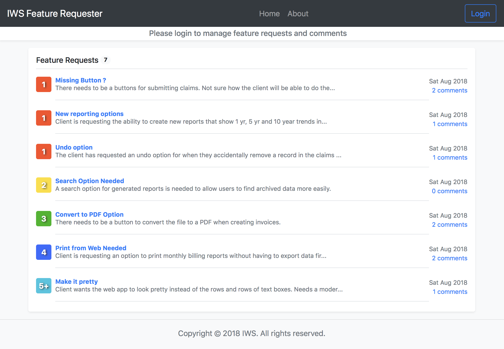
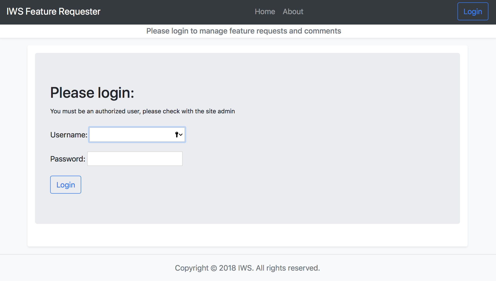
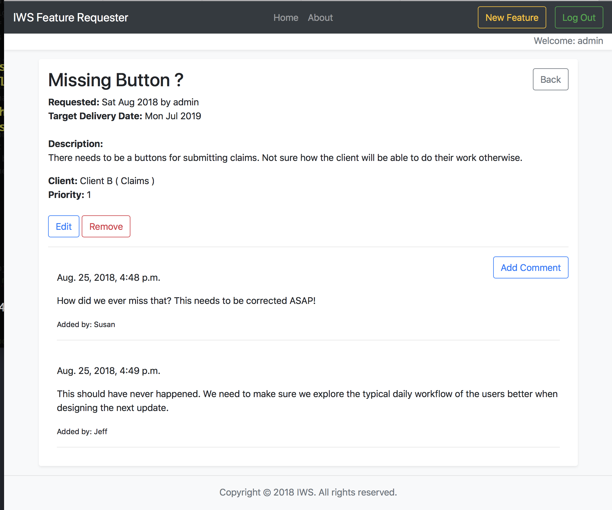
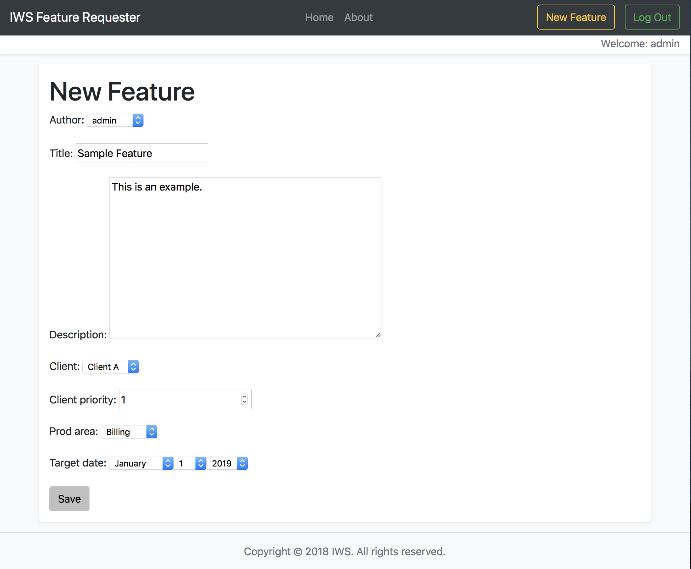
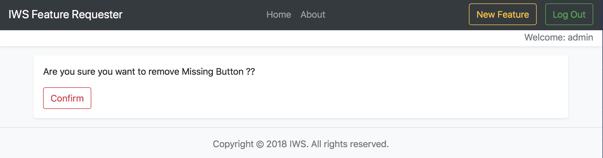
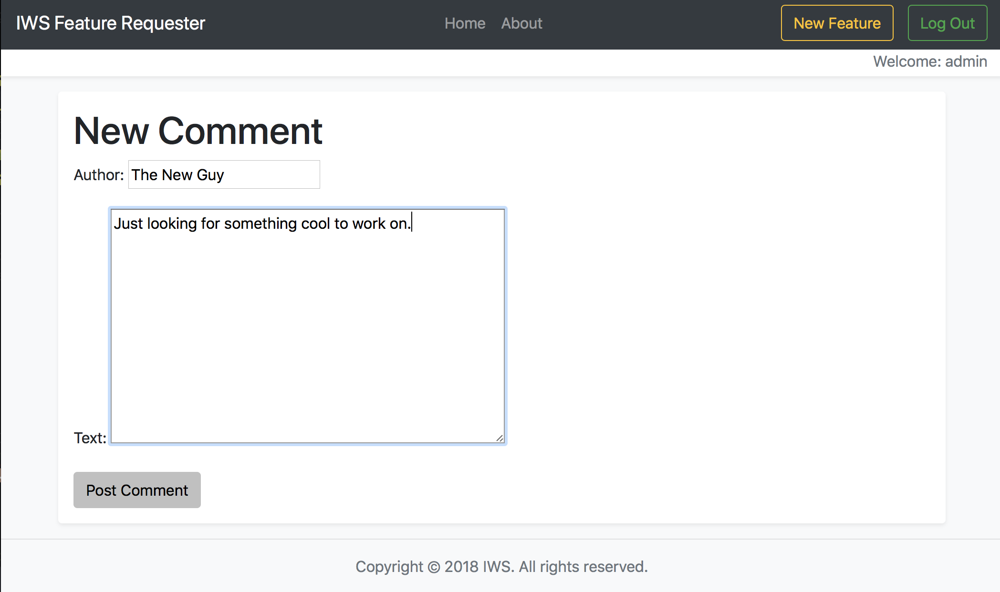
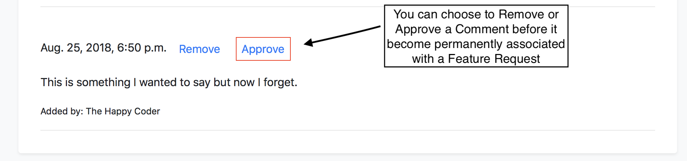

# IWS Feature Request App

A CRUD application for managing feature requests and adding comments. Only superusers are allowed to create/read/update/delete requests and post/approve/remove comments. Uses Django 2.1 and runs on Python 2.7 or Python 3.6+.

## Features

* A fully responsive CRUD web application for viewing and managing feature requests and comments.
* Uses Django 2.1 and Bootstrap 4.1.
* Color coded priority level indicators from 1-5+ and also handles unknown levels.
* Includes sample data in db.json to load into empty SQLite database for testing.

## Open Source

This application runs on open source software.

* **Python 2.7 / 3.6** - Scripting language the app is written in
* **Django 2.1** - The backend framework for this project
* **Bootstrap 4.1** - Used to make everything responsive and pretty
* **holder.ja** — Used to create color coded priority badges
* **Pillow 5.2.0** — Python Imaging Library used for static files
* **Django-Ordered-Model 2.1.0** — Django package for rearranging feature request's client priority
* **Coverage.py 4.5.1** — Tool for measuring code coverage through tests
* **Factory-Boy 2.1.1** — Tool for creating test data
* **Coveralls 1.4.0** — Service for publishing coverage stats online with Coverage.py

## Running the App

### Install Dependencies

Use `pip` to install the app's dependencies from requirements.txt:

    pip install -r requirements.txt

### Migrate the Database

Running migrations will create the SQLite database.

    python manage.py migrate

### Load Sample Data

Next, load the sample data into the database.

    python manage.py loaddata db.json

This adds 1 admin superuser, 3 clients, 4 product areas, and 8 sample feature requests.

### Run the Server

    python manage.py runserver

Finally, run the server and navigate to http://127.0.0.1:8000/ in your browser.

### Exploring the web app

1. Click on 'Login' in the upper right.

2. Enter 'admin' for username and 'django1234' for password.

3. Once logged in, you will see the 'New Feature' button in the upper right next to 'Log Out'. Click 'New Feature' to add a new feature request.

4. To edit an existing request, from the main 'Home' screen, click on an existing feature request title, choose the 'Edit' button. Make the changes and click on 'Save'. Click 'Back' in right portion of screen to return back to view all feature requests.

5. To delete an existing request, from the main 'Home' screen, click on an existing feature request title, choose the 'Remove' button. Click 'Confirm' to remove the request. (Note: This also removes all associated comments as well)

6. To add a comment, select an existing feature request from the 'Home' screen. If you are logged in you will see the 'Add Comment' button on the lower right. (Note: If you are not logged in this button will not appear). Enter your name (this can be any name, nickname, etc.) and then your comment. Click on 'Post' to add it to the feature request. You will have an option to 'Remove' or 'Approve' the comment before it is permanently added to the feature request. (Note: If you need to remove the comment after it has been added, you will have to go to Django /admin/ path and login and then locate the comment in the Comments table.)

7. Notice the priority color coding next to each feature request. This shows priorities 1 to 5+ by default. Priorities of 1 will be in red (for Hot or High Priority) while a priority of 5 or greater will be in blue (for Cold or Low Priority). If a priority is set to nothing (empty) or zero, then it will show as a '?' in purple which means unknown.

8. Client Priorities can be automatically re-ordered if they are edited or if a new feature request is added for a particular client that has a higher priority of 1. This will re-assign the other existing priority levels for each client automatically so no single client has more than one Level 1, 2, 3, 4, 5 or greater priorities. This is managed on a per client basis so that both Client A can have a priority of 1 and Client B can also have a priority of 1 without a conflict.

9. Also see the 'About' screen for brief information on the web app and the developer. Other notable features include a total feature request count in a bubble on the 'Home' screen next to 'Feature Requests' heading. All features requests can be viewed even if you are not logged in, but they can only be created, edited or removed by an authenticated user. Comments can only be added and approved once logged in as well.

Enjoy!

## Running the Tests

To run the tests, first ensure that you are in the project's root directory
(the one that contains the files `manage.py`, `README.md`, and `requirements.txt`).
Then run the following command:

    coverage run manage.py test

To view the test coverage statistics run `coverage report`.

## Screenshots

### Feature Request List

### Login Screen

### Feature Detail

### Create New Feature Request

### Remove a Feature Request

## New Comment

## Approve Comment

